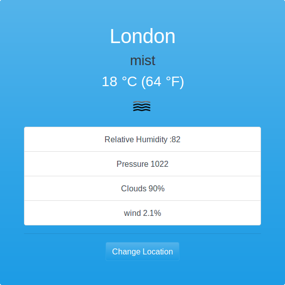
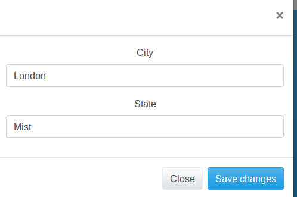

# Call [openWeatherMap](https://openweathermap.org/) to fetch weather by city name .

## Search weather by city name :city_sunset:
## Then save city in localstorage .
### Jeddah is default city when page loaded .

### This app contain same formula to convert degrees 
- kelvine to celisus 👨‍🎓. 
- kelvine to fah 👨‍🎓.

### Built whoal webPage by using JS and Bootstrap.